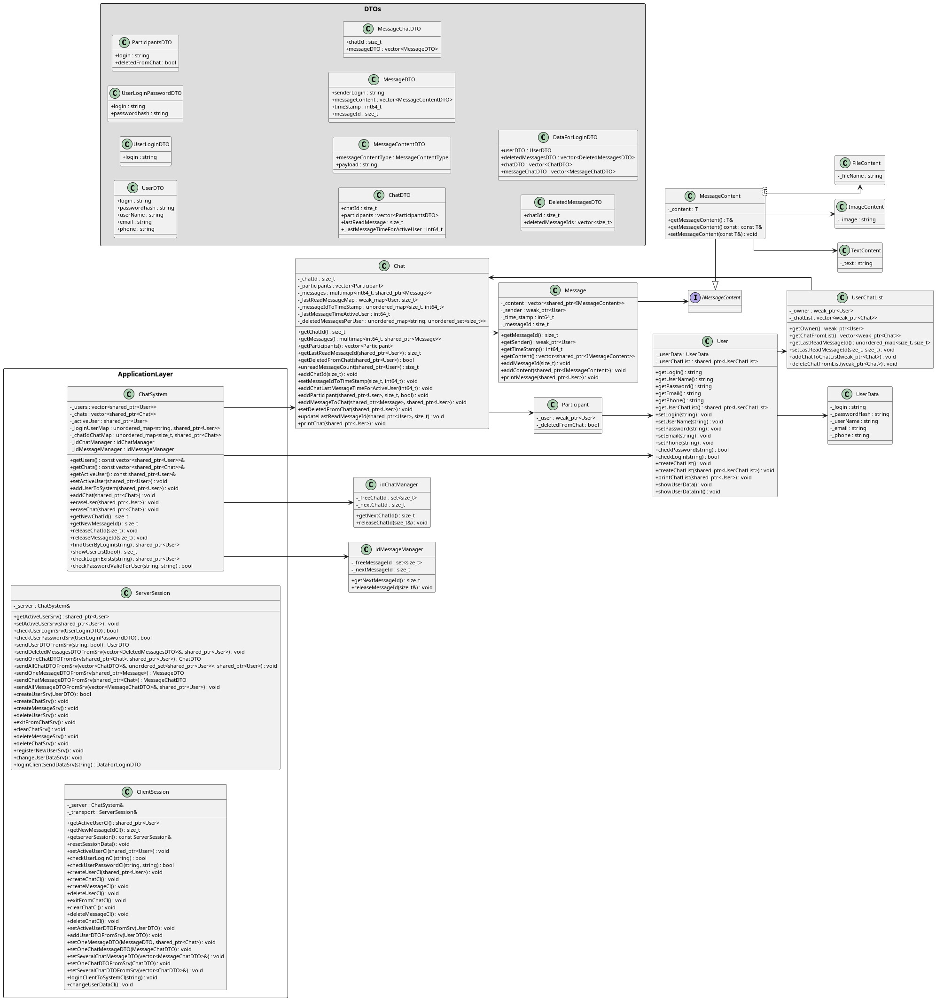

# 💬 ChatBot SHARK v 2.0 2025 made by Yan Batytskiy

**ChatBot** — это клиент-серверная версия TCP система чатов на C++20, поддерживающая регистрацию, авторизацию, создание чатов и отправку сообщений. Проект построен на модульной архитектуре с использованием `smart pointers`, пользовательских исключений и `CMake`. Клиентская часть умеет автоматически искать серверную часть на локальной машине, в локальной сети либо на удаленном сервере через DDNS. 

На данный момент система работает только под Linux и Mac OS. Клиент и Сервер могут быть запущены в разых ОС.

---

## 🧱 Структура проекта

```
ChatBot/
├── CMakeLists.txt
├── build_macos/ # Сборка под macOS
├── dist/ # Сборка под Linux
├── scripts/ # Скрипты сборки (не все отслеживаются Git)
├── src/
│ ├── client/
│ │ └── menu/
│ ├── core/
│ │ ├── chat/
│ │ ├── chat_system/
│ │ ├── exception/
│ │ ├── message/
│ │ ├── system/
│ │ └── user/
│ ├── dto/
│ └── server/
├── build/ # Временные CMake-файлы
└── README.md```

## 📦 Изменения архитектуры

1. Реализована система, так называемого "умного клиента", который хранит у себя часть данных, 
	относящихся к активномму пользователю. Клиент и Сервер обладают идентичной структурой, 
	что позволит в следующих версиях Клиенту работать без онлайн доступа к серверу 
	с последующей синхронизацией в обе стороны.
	Общие сущности вынесены в core для формирования динамической библиотеи для подключения 
	к обеим сторонам (клиент и сервер).

2. Система меток времени переведена на хранение в int64_t с размерностью до миллисекунд
	и форматированием в читабельный вид при выводе на экран.

3. В структуру Chat добавлен контейнер unordered map _messageIdToTimeStamp для быстрого поиска 
	сообшения по его временной 	метке и messageId.
	Хранение Сообщений переведено с vector на multimap с ключом по временной метке с поиском О(1).

4. Введены структуры DTO для обмена с сервером. Созданы шлюзы с обеих сторон на отправку 
	и получение данных.

5. Заменена система проверки корректности аглийских символов и цифр

6. Уменьшено количество использования weak_ptr через использование контейнеров unordered map, 
	multimap и т. д.

7. В верхний уровень ChatSystem введены:
	7.1 std::unordered_map<std::string, std::shared_ptr<User>> _loginUserMap - поиск пользователя по логину
	7.2 std::unordered_map<std::size_t, std::shared_ptr<Chat>> _chatIdChatMap - поиск чата по логину
	7.3 и т. д.

8. Добавлена идентификация операционной системы при запуске.

9. Минорное перераспределение методов между сущностями для улучшения структурности.

10. Наличие в коде тестовых процедур для онлайн тестирования данных (закомментированы в product версии).

11. Клиентская часть умеет автоматически искать серверную часть на локальной машине, в локальной сети 
либо на удаленном сервере через DDNS.	
При обрыве соединения умеет это определять и восстанавливать его.


## 📦 Классы и связи



---

## ⚙️ Требования

- C++20-совместимый компилятор (`g++`, `clang++`, `MSVC`)
- `CMake` версии **3.16+**
- (рекомендуется) `clangd` для автодополнения и анализа

---

## 🛠️ Сборка и запуск

### 🔧 1. Конфигурация проекта

### 📂 Скрипты

Папка `scripts/` содержит кастомные скрипты сборки:

- `build_macos.sh` — сборка под macOS (создаёт `build_macos/`)
- `build_linux.sh` — сборка под Linux (создаёт `dist/`)

### 🧪 2. Сборка
```bash
cmake --build build
```

### 🚀 3. Запуск
```bash
# Для macOS
./build_macos/client
./build_macos/server

# Для Linux
./dist/linux/client
./dist/linux/server

```

---

## ✨ Возможности

- Регистрация и вход пользователей.
- Создание личных чатов.
- Передача сообщений с временем, авторством, указанием количества новых сообщений
- Поиск пользователей по любым символам в Логине и Имени
- Поддержка `shared_ptr` / `weak_ptr` для контроля ресурсов
- Валидация ввода и пользовательские исключения
- Удобное меню на русском языке в терминале
- Возможность расширения (аватары, поиск, фильтрация и т.д.)

---

## 📷 Скриншот (пример)

```text
ChatBot 'Shark' Версия 2.0. @2025

1. Регистрация пользователя
2. Войти в ЧатБот
0. Завершить программу
```

---

## 📚 Лицензия

MIT License
